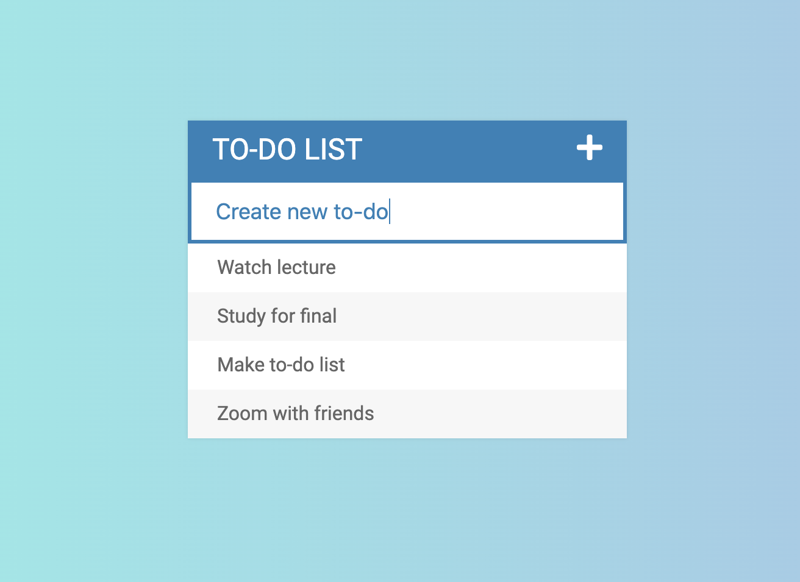

# Todo List App   
#### Author: Jesnine Erillo   
Simple to-do list web app project from my web dev course on Udemy, using HTML/CSS/JS and JQuery.

## Features:
- Add new todos to your list
- Mark todos as complete by crossing off list item
- Delete unwanted todos from your list

## How to use:
**Creating a new todo:**
- Click the plus symbol (+) in the upper right corner to toggle "Add New Todo" textbox.    

- To create new todo, enter text in the "Add New Todo" textbox. 
- Once finished entering your new todo item, hit enter and the item will appear in your list.

**Completing a todo:**
- Click a todo list item to mark it as complete. Once marked, the item appear crossed out.    

**Deleting a todo:**    
- Hover mouse over the left side of the todo item text and a red trash button will appear.
- Click the red trash button to delete the todo from the list.    

